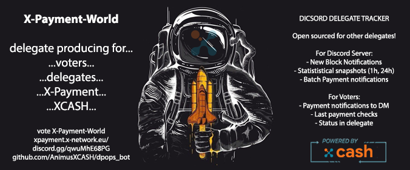

[](https://www.codefactor.io/repository/github/animusxcash/dpops_bot)


# About
Discord Bot monitor which can be deployed by anyone on their private server to allow server members interract with DPOPS api.


# Integrated functions

- [x] Voter 
    - [x] Management of own voter profile
        - [x] Apply public key for easier queries presented below
    - [x] Voter queries with or without registered profile
        - [x] Last 4 payments sent by delegate for voter
        - [x] Current state of the voter in delegate
        - [x] ROI calculations based on vote amount
    - [X] Apply for payment notifications
        - [x] Apply for payment notifications when voters public key is in the batch of payments

- [x] Server owner
    - [x] block tracking
        - [x] Register for automatic notifications when delegate produces new block
    - [x] Delegate statistical notifications - multi time frames
        - [x] Hourly overall statistical snapshots of delegate
        - [X] Other timeframes: 3h, 4h, 6h, 12h
        - [X] Daily overall statistical snapshots of delegate
    - [x] Automatic payment notifications
        - [x] Notify to Discord channel when batch of payments is sent out
        - [X] Exact payment notifications to registered voters in system if in batch
    - [X] Twitter relay
        - [x] Daily delegate statistic snapshots 
        - [x] Call to vote for delegate 
        - [x] Batch Payment Notifications and conversions
        - [x] New Block alert
        - [x] Integrated X-Cash foundation promotion tweets

- [X] X-Cash DPOPS network queries
    - [X] Ranking top 10 DPOPS network
        - [X] by blocks produced
        - [X] by votes gathered
        - [X] by verified blocks
        - [X] All above categories for your delegate


# How to's

Check availabale commands through Discord with 
```text
@botTag help 
```

[Installation Instructions](../docs/INSTALLATION.md)

[Activate Services as server owner](../docs/OWNER.md)

# Command map 
[Commands for Voters](../docs/VOTER.md)

[Commands for Discord Server Owners](OWNER.md)

[Other Commands](../docs/OTHER.md)
    

# Contribute
If you would like to contribute to project please open up issue with proposal. Thank you!

## Contributors 
<a href="https://github.com/AnimusXCASH/dpops_bot/graphs/contributors">
  
</a>

Made with [contributors-img](https://contrib.rocks).

# Support 
## Discord X-Payment-Delegate Discord Server
[Invite Link](https://discord.gg/pj9JCmTeJc) (User @Animus)

# Tip Jar
- [x] Through X-Payment system to user `Animus#4608 (ID:360367188432912385)`
- [X] Support to delegate through voting : `vote X-Payment-World`
- [x] To Wallet: `XCA1d9H82oZP1ytt8ULMVFa6GNaX1RWHz8EFpwFNDgDbCEkzvZGP384Qfz6DJxjsmU2ernSQguqKgLDVkm1VteVT4ZiPJiSEVN`
